# 「いつか使うかもしれない」はコストになる

原稿: dhythm/private-note `Zettelkasten/PermanentNote/20250819_「いつか使うかもしれない」はコストになる.md`（note.com からは取らない。作業者は必ず原稿を読む）

ディレクトリ案: `20261007_「いつか使うかもしれない」はコストになる`（同日のガント作品と衝突しないタイトル付き。リポ係が最終確認）

## 最初に分けること

維持するもの
- 形式は撮影なしのキネティックタイポグラフィ／モーショングラフィックス。画面全体が動く。実装は three.js 推奨（使わないときは理由を短く書く）。
- 主張: 「いつか使うかもしれない」で溜めたものは、容量だけでなく検索しにくさと機会の喪失としてコストになる。データは資産であると同時に負債。必要なのは捨てる勇気と整理する習慣。
- 理由と留保を落とさない。データは資産でもある。RAG などで以前より探しやすくなる可能性はあるが、まだたどり着けないことも多い。整理は唯一の正解の断定にしない。
- 動きの課題は1つ（雪崩れ込み→圧縮→資産／負債の裏返し→滑って隙間が開く）。

変えてよいもの
- 上映順。記事は物理→デジタル→企業→整理。映像はカードの圧迫から入り、資産／負債の転換を中心に据え、物理と企業は同じ構造の例として短く添える。
- 画面の文言、書体、配色、間。最終判断は作業者。
- 尺。約1分（文字数と観察時間で調整。1分固定にしない）。案の35〜40秒から、留保と理由を足して伸ばす。

提案側の仮説（原稿にはない）
- 「ファイル／カード」を画面上のオブジェクトにし、外周から雪崩れさせて圧縮する。原稿は図を指定していない。
- 「資産」ラベルが裏返って「負債」になる演出。原稿は両方を同時に理解せよと書いており、資産が消えて負債だけになる意味ではない。裏の面に「負債」が見え、表の「資産」も残る／両方見える着地にする。

## 狙いたい印象

圧迫 → 裏返りの気づき → 隙間が開く解放。フェード中心にしない。圧縮の強さと、隙間が開くときの速度で魅せる。

## 手元で使える素材（クリエイター棚卸しを採用）

- コード作画のカード／ファイル図形（SVG または three.js の Plane）。雪崩れ・圧縮・滑りはこれで足りる。
- 「資産」「負債」は文字そのもの（裏返しはモーション）。
- 本棚・クローゼットは簡略図形で足りる想定。実写不要。
- 過去企画のガントSVG、人物／盾、**20261007 ガント不採用 BGM** は流用しない。
- まだ集めない: 外部写真、生成動画、原稿埋め込み webp（著作未確認）。構成固まり後に最小限だけ。

## NANKA DEKIRU 検証（企画前）

サイト https://esoragototv.com/tools/nanka-dekiru/index.html を確認。非公開原稿は入力していない。一般化した作品説明（約1分・カードが雪崩れ圧縮し資産／負債が裏返り隙間が開くキネティック）で適合を判断。

| 参考 | 今回の使い方 | 採用判断 |
|---|---|---|
| S16 歌詞が跳ねる | 「いつか使うかも」「コスト」「資産」「負債」「検索」など主張語の拡大・回転・受け渡し | 採用候補。読む間も語が動き続ける |
| three.js カードの裏返し（Plane＋rotateY） | 「資産」→裏に「負債」 | 採用候補。課題の中心拍。資産が消えたように見せない |
| 画面全体のスケール圧縮 | 雪崩れ後の圧迫 | 採用候補。課題の前半 |
| P23 ばねでつながる字 | カード同士の引き込み | 任意。全編の微振動にはしない |
| G16 ズームブラー | 裏返し着地の短いアクセント | 任意。読む区間をぼかさない |

ライブラリ名や見本素材の転用はしない。動きの仕組みをフレーム再現可能な位置・回転・スケールへ翻訳する（Remotion 併用時も同じ）。

## 動きの課題は1つ

外周からカードが内側へ雪崩れ込み、画面全体が圧縮される → 「資産」が裏返って「負債」が見える（表の資産理解は残す） → カードが滑って隙間が開き、奥の必要な一枚が見える。

- 意味: 溜め込みは空間を奪い（圧縮）、見え方は資産でも維持と検索不能は負債、整理して隙間を作るとたどり着ける。
- この変形は一連の課題として一度走らせる。着地後も語と構図は動かし続けるが、カードの大構造は「隙間が開いた状態」を保つ（また閉じない）。
- 「大きな変形は一度だけだから後半は静止」にはしない。隙間が開いたあと、語のスケール・視点の移動・並べ替えの小運動で勢いを渡す。

## カット表 v2（1行＝1カット）

形式: 1行＝1カット。はじめ／おわりは生成画像のコマ画（`assets/storyboard/cut-01-start.jpg` … `cut-07-end.jpg`。一覧 [contact-sheet.jpg](assets/storyboard/contact-sheet.jpg)、1はじ／1おわ … 7はじ／7おわ）。構図の文章は表に残し、動きは文章。文言だけの表は完成にしない。手作業の SVG 絵コンテは不採用（読みにくく、制作に時間がかかった）。正本は JPG。**画面の言葉は最終案**（クリエイター確定・2026-10-07）。読了目安は毎秒約7字＋1拍（参考）。図形の観察時間は別途。等速再生で判断する。

字数合計: **299字**（16文／7カット）。読了≈43s＋拍≈16s≈59s。雪崩れ・圧縮・裏返し・隙間の観察を足し、映像尺目安 **約1:02〜1:08**（v1の1:02前後から＋数秒。カット3・6の留保を読む間を確保）。

タイミング調整（v1→v2）: カット2〜3を各+1〜2s（サンクコスト理由／資産＝負債の両面）。カット6を+3s（RAG留保）。カット7を+3s（結論2文）。全体を約1:05前後へ。

| # | 秒目安 | はじめ | おわり | 動き（文章） | 画面の言葉（最終） | 要る素材 |
|---|---|---|---|---|---|---|
| 1 | 0:00–0:08 | 余白の多い画面。外周に薄いカードの縁だけ。[cut-01-start.jpg](assets/storyboard/cut-01-start.jpg) | カードが画面を埋め、中央が息苦しい。[cut-01-end.jpg](assets/storyboard/cut-01-end.jpg) | 外周からカードが雪崩れ込み、画面全体がわずかに内側へ引っ張られる | 「いつか使うかもしれない」／そう言って、物もファイルも取っておく。 | card-file / cards-avalanche-dense |
| 2 | 0:08–0:17 | 埋まったカード壁。[cut-02-start.jpg](assets/storyboard/cut-02-start.jpg) | カード壁がさらに縮み、余白が消える。[cut-02-end.jpg](assets/storyboard/cut-02-end.jpg) | 画面全体が圧縮。語が押しつぶされながら大きく打たれる | 捨てられないのは、サンクコストだ。／取っておく間に、劣化し、場所を占め、心の余裕まで圧迫する。 | cards-compressed |
| 3 | 0:17–0:27 | 圧縮された壁＋「資産」ラベル表。[cut-03-start.jpg](assets/storyboard/cut-03-start.jpg) | 同じ壁のまま、ラベルが半回転して「負債」が見える。表の「資産」も残る。[cut-03-end.jpg](assets/storyboard/cut-03-end.jpg) | ★課題の中心。カード群の「資産」面が裏返り「負債」。資産も理解として残る（両方見える着地） | データは資産だ。／同時に、維持管理の負債でもある。／多いほど、たどり着きにくい。 | label-asset-liability |
| 4 | 0:27–0:36 | 裏返った直後の密な壁。[cut-04-start.jpg](assets/storyboard/cut-04-start.jpg) | 壁に細い隙間が走り始める。[cut-04-end.jpg](assets/storyboard/cut-04-end.jpg) | カードが横へ滑り、隙間が線のように開く。圧縮の反動で画面が少し広がる | デジタルも同じだ。多すぎると、探せない。／検索できなければ、それはコストだ。 | cards-gap-open（開き始め） |
| 5 | 0:36–0:46 | 隙間の奥に一枚だけ光る。[cut-05-start.jpg](assets/storyboard/cut-05-start.jpg) | 隙間が本棚の列のように整列し始める。[cut-05-end.jpg](assets/storyboard/cut-05-end.jpg) | 滑ったカードが列に並び替えられる。視点が少し前進 | たどり着けないなら、宝の持ち腐れだ。／必要なのは、捨てる勇気と、整理する習慣だ。 | cards-gap-open + shelf-lines |
| 6 | 0:46–0:56 | 整列の途中。[cut-06-start.jpg](assets/storyboard/cut-06-start.jpg) | 整列は続くが、完全には埋まらない余白を残す。[cut-06-end.jpg](assets/storyboard/cut-06-end.jpg) | 並べ替えの勢いを保ちつつ、余白を「機会」として残す。語が余白側へ移動 | RAGで、以前より探しやすくなることもある。／それでも、まだ届かないことは多い。／だから、見直しと削除が要る。 | 文字＋余白 |
| 7 | 0:56–1:05前後 | 余白と整列が共存。[cut-07-start.jpg](assets/storyboard/cut-07-start.jpg) | 余白側に結論の語が着地して止まる（エンドカードなし）。[cut-07-end.jpg](assets/storyboard/cut-07-end.jpg) | 最後の語が余白から強く入り、カード群は微動だけ。冒頭の主題宣言なし。元記事表示なし | 「いつか使うかもしれない」は、今の生産性を確実に下げる。／定期的な見直しと、思い切った削除が、真の資産を生む。 | 文字 |

画面文言の確定メモ: references.md 第3節。〔要約〕主体、「いつか使うかもしれない」のみ短い「」。留保（資産でもある／RAGの限界／整理の断定回避）をカット3・5・6で保持。v1案の「整理すれば、たどり着ける」は断定に聞こえるため、勇気＋習慣の文に差し替え。

## 絵コンテのコマ画

はじめ／おわりの画。正本は生成画像（JPG）。並びの意味は変えない: 雪崩れ込み → 圧縮 → 資産／負債の裏返し（両方見える）→ 滑って隙間が開く。手作業 SVG の絵コンテは不採用。`assets/storyboard/` に SVG は置かない。カード図形の制作用 SVG（`assets/card-file.svg` など）は絵コンテではない。

一覧: [contact-sheet.jpg](assets/storyboard/contact-sheet.jpg)（1はじ／1おわ … 7はじ／7おわ）。

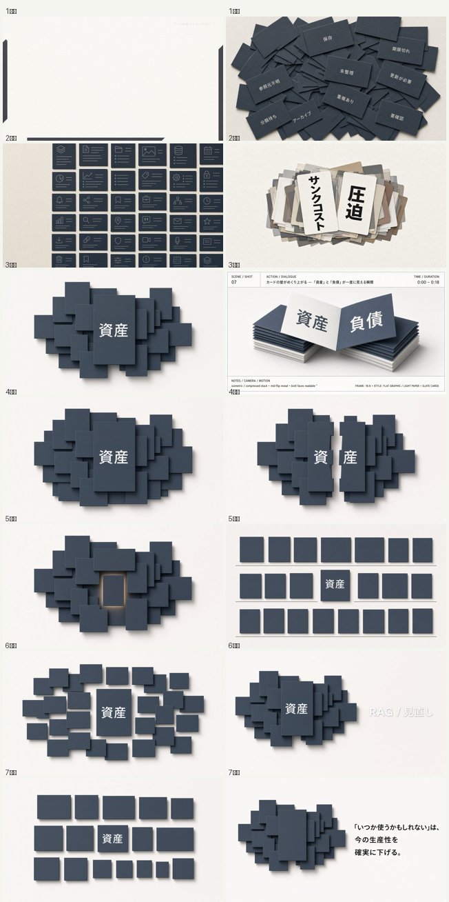

| カット | はじめ | おわり |
|---|---|---|
| 1 | 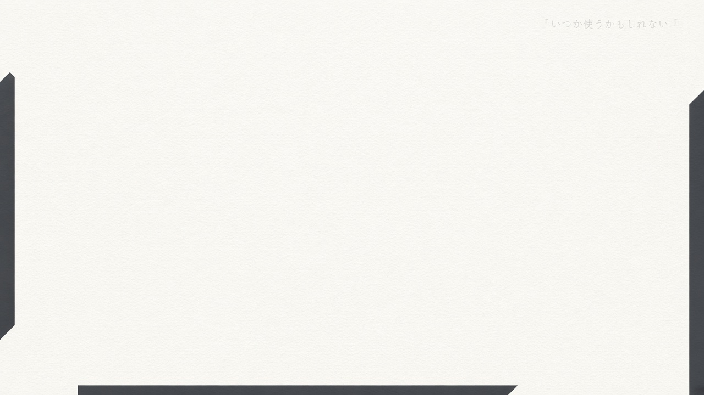 | 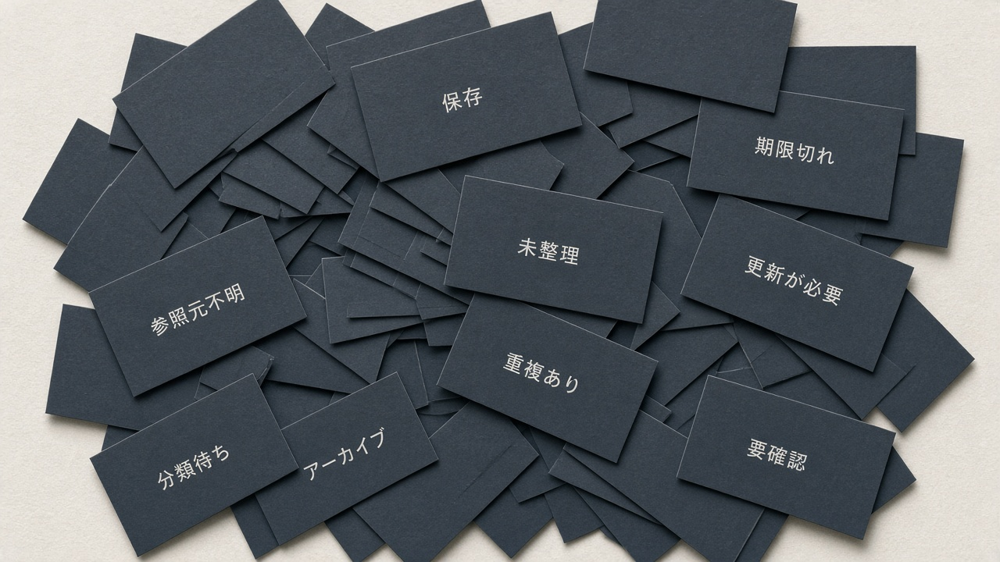 |
| 2 | 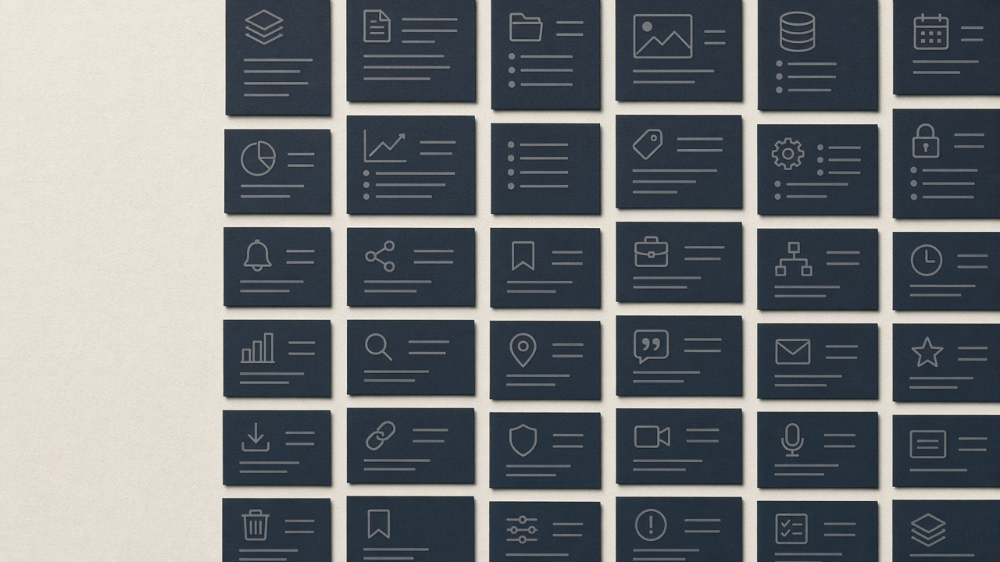 | 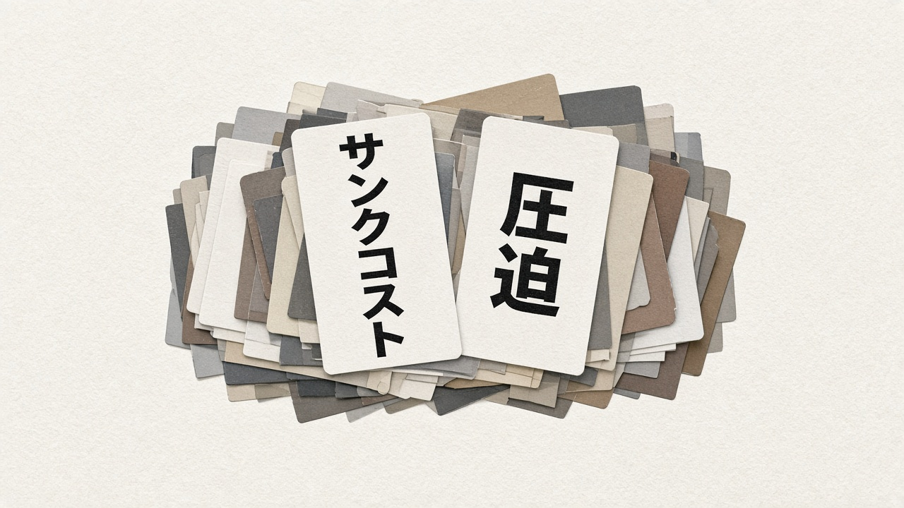 |
| 3 | 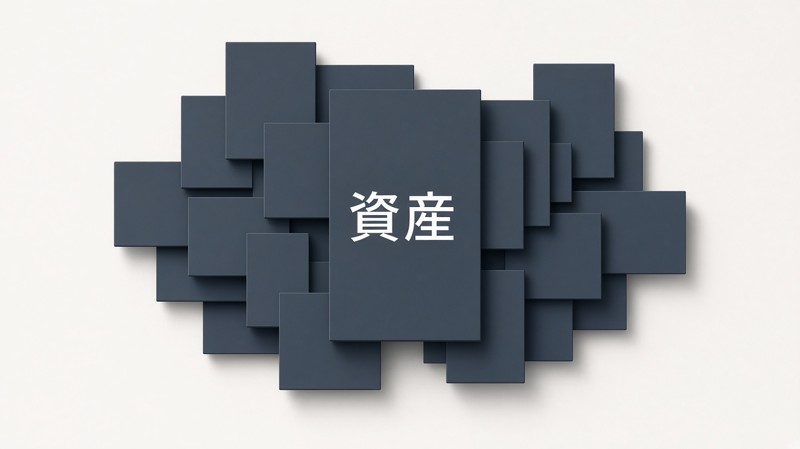 | 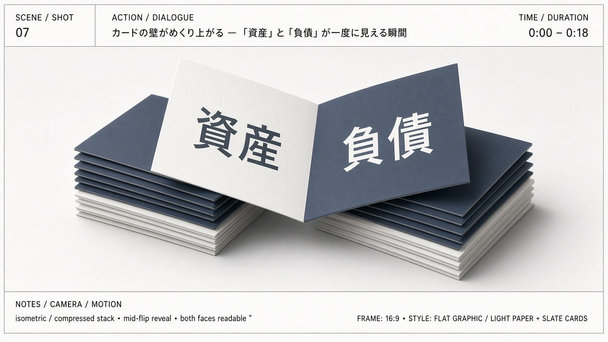 |
| 4 | 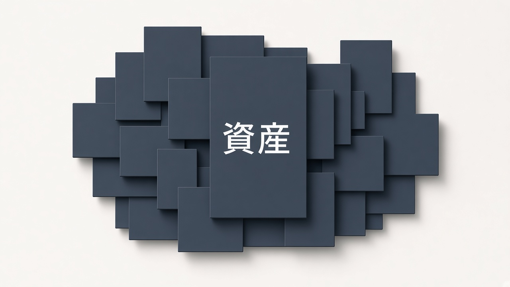 | 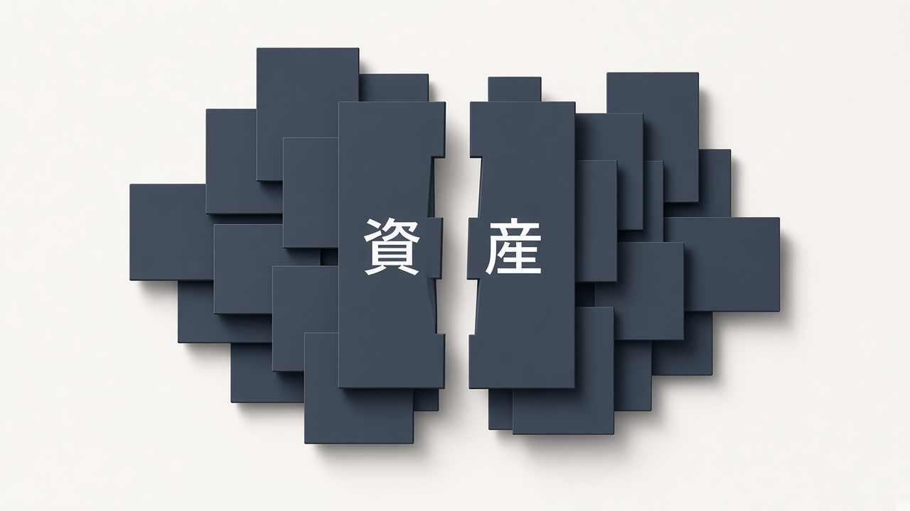 |
| 5 | 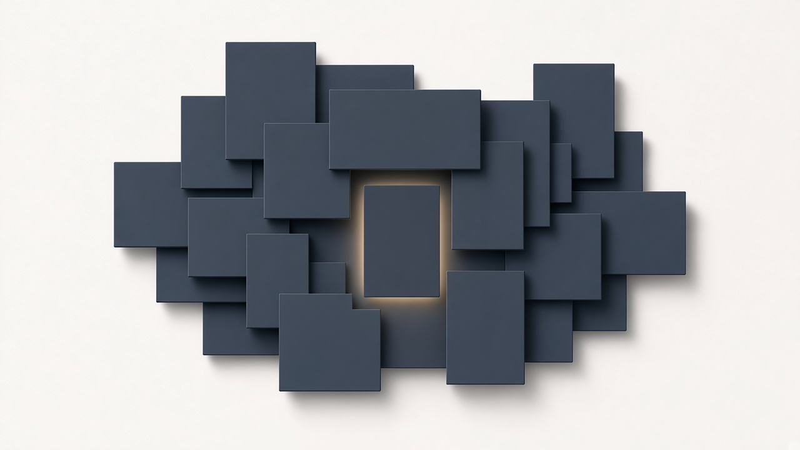 | 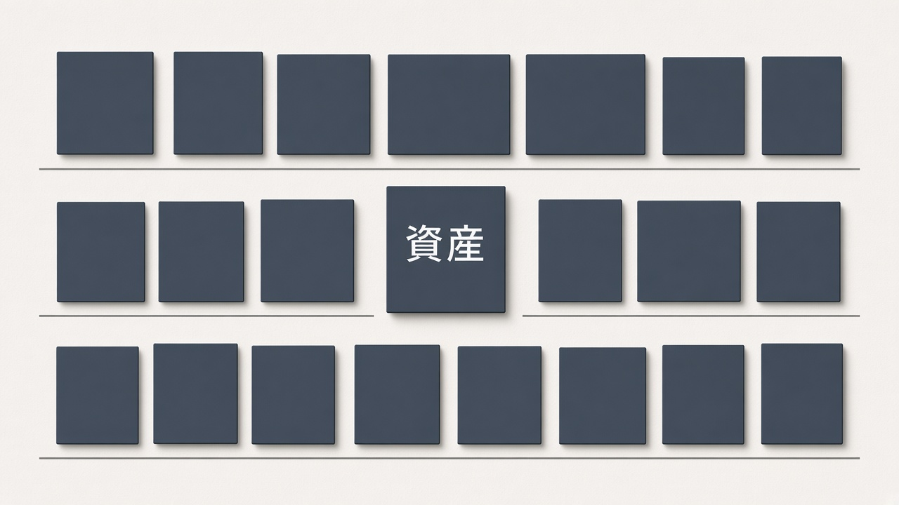 |
| 6 | 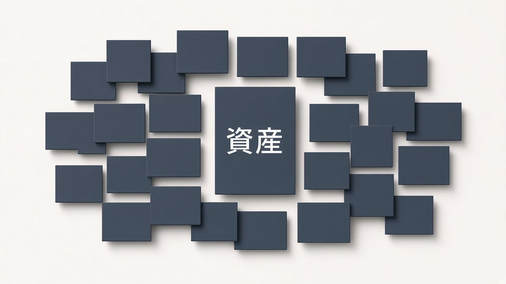 | 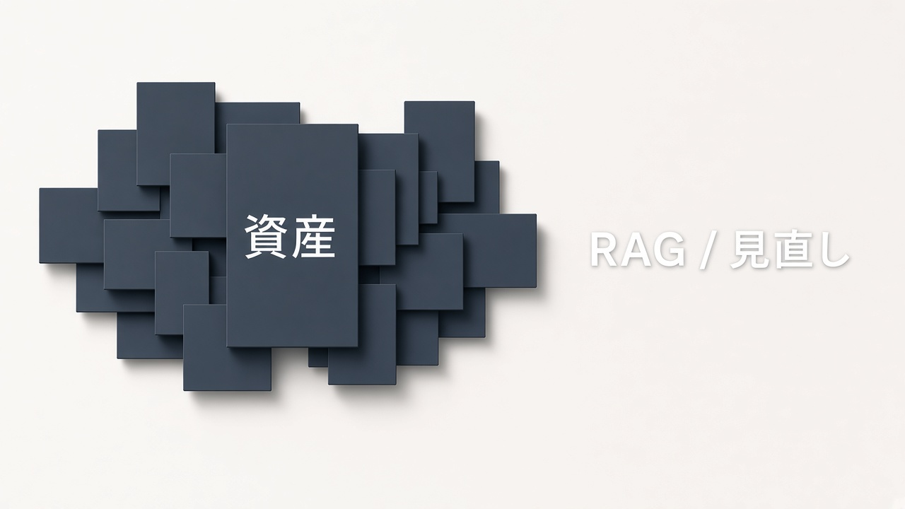 |
| 7 | 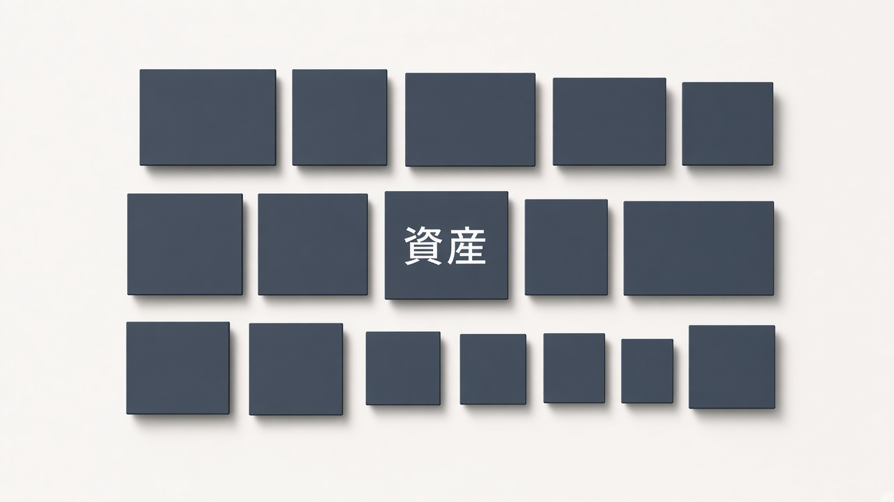 | 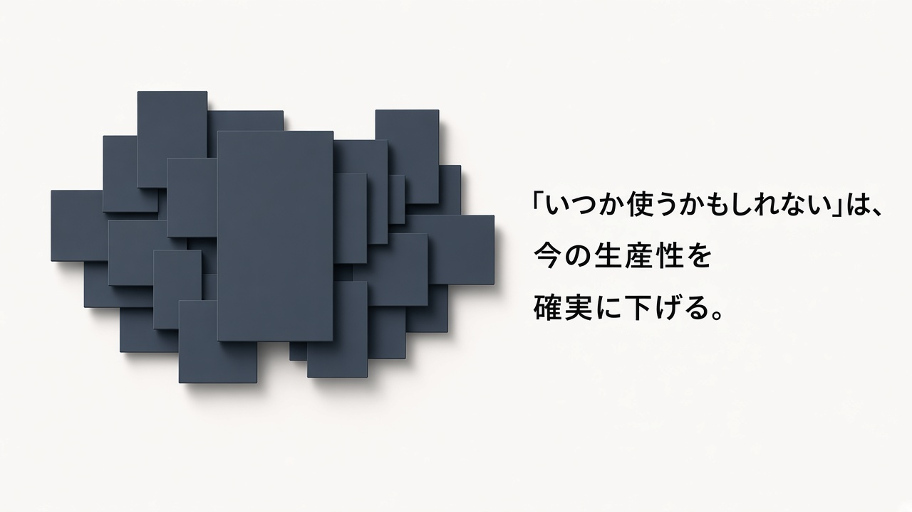 |

## 骨組み対応（合格用）

| 拍 | 原稿の根拠 | 観客に残す主張 |
|---|---|---|
| 問い〜圧縮 | 物を捨てられない／サンクコスト／占有と劣化 | 「いつか」で溜めると、今の場所と余裕を奪う |
| 転換 | 企業のデータは資産であり負債 | 資産と負債の両方を見る |
| 隙間〜整理 | 検索容易性／本棚 | 多くて探せないならコスト。整理でたどり着く |
| 留保 | RAGはまだ不完全 | 技術だけで免責しない |
| 結論 | 最終段落 | 「いつか」は今の効率を下げる。見直しと削除 |

不合格: 「捨てろ」だけが残る。資産であることが消える。RAGで全部解決／整理すれば必ず勝てる、の断定。文字を外して分かることを合格にしない。

## 仕様

- テスト 1280x720、30fps。ナレーションなし。
- BGM は企画ごとに新規選定（躍動感を支えるリズム）。ガント不採用曲は使わない。確定尺を覆う長さにする。
- 入れない: 冒頭の主題宣言、末尾の元記事表示（言われるまで）、章表示、テロップ帯、ロゴ、文字だけのスライド。
- 生成動画は使わない前提。必要なら対象・範囲・クレジットを示し、明示承認の前にテストしない。

## 制作の進め方

1. カット表は v2（文言確定）。はじめ／おわりのコマ画は生成画像 `assets/storyboard/*.jpg`。固まってから外部新規素材（今回は基本不要想定）。実装前に (a)(b)(c) を等速で見る。
2. 全編の前に、(a) 雪崩れ〜圧縮、(b) 裏返し、(c) 隙間〜結論、を等速で見る。代表静止画だけでは動きを合格にしない。
3. 書き出し完了と作品として通ったことは分けて報告する。

## これがあればもっと良くなる

- 躍動感に合う器楽曲1本（企画専用。拍がはっきりしているもの）。
- 商用可の太い見出し書体（カード上の短語用）。
